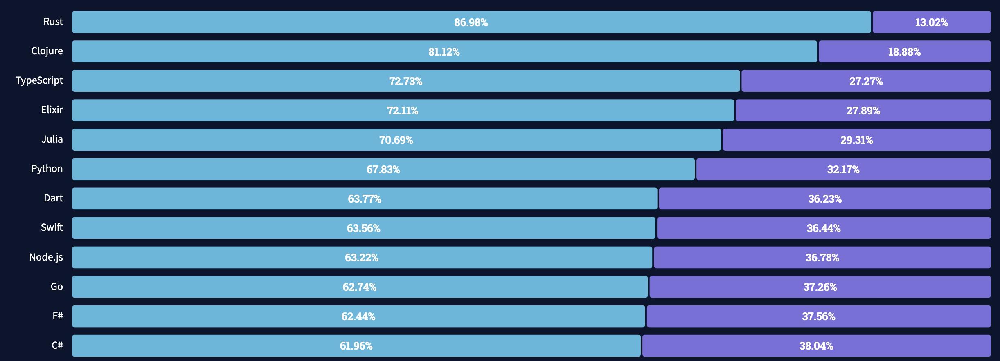
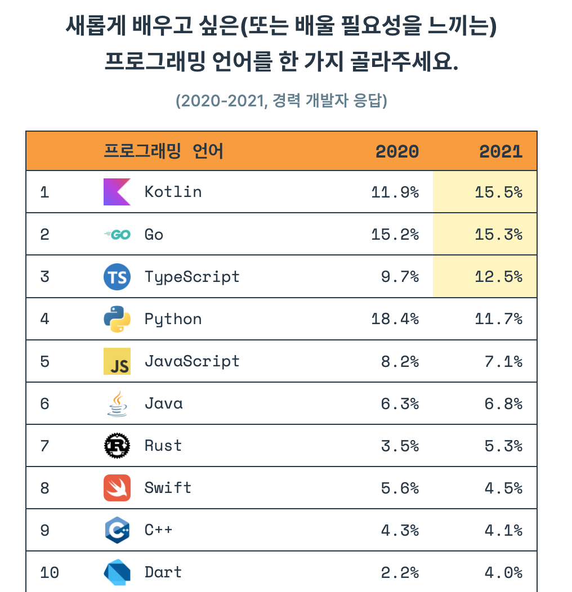
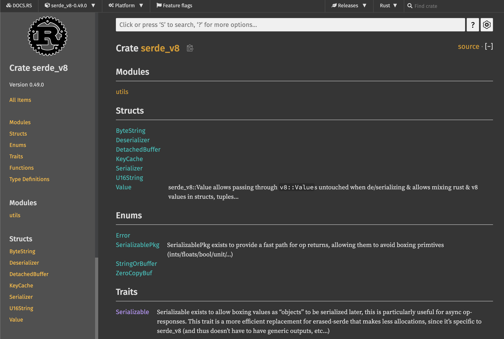
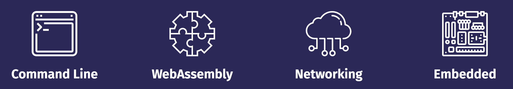
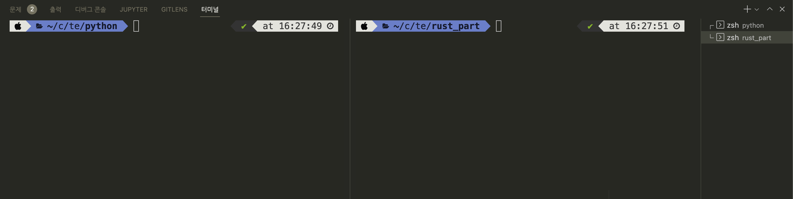

# CH1. 러스트 시작하기

[toc]

 

## 파이썬 개발자가 러스트를 배워야 하는 이유

```python
print("Hello, Pythonista!")
```

```rust
fn main() {
    println!("Hello, Rustacean!");
}
```


파이썬은 가장 사랑받는 언어 중 하나입니다. 간결한 문법과 범용성 덕분에 서버 개발부터 딥러닝 모델 개발까지 다양한 분야에서 사용되고 있습니다. 하지만 파이썬은 개발 시의 높은 생산성을 위해 코드 실행 속도를 포기한 언어입니다. 특히 파이썬의 태생적 한계인 GIL(Global interpreter lock)때문에 빠른 연산이 필요한 작업이나 멀티스레딩 프로그램에서 좋은 성능을 내기 어려운 단점이 있습니다.

러스트는 컴파일 언어로, C/C++의 99%에 가까운 성능을 가지고 있어서 빠른 연산속도를 필요한 분야에서 각광받고 있습니다. 2021년 스택오버플로우 개발자 설문조사의 "Loved vs Dreaded(사랑하는 언어 대 두려운 언어)"에서 러스트는 86.98%라는 높은 비율로 가장 사랑받는 언어로 선정되었습니다.



국내에서도 2022 프로그래머스 설문조사에 따르면 러스트는 5.3% 비율로 7위를 차지해 꽤 상위권에 위치해 있는 편입니다. 



왜 국내/외에서 러스트를 배우고 싶어할까요? 많은 개발자들이 러스트를 배우고자 하는 가장 큰 이유는 "신뢰성"입니다. 러스트만의 독특한 타입 시스템과 소유권(ownership) 모델 덕분에 메모리 안전성과 스레드 안전성이 보장됩니다. 이 두 가지가 컴파일 타임에 체크되기 때문에 런타임에서 예상치 못한 버그가 발생하는 것을 예방할 수 있습니다. 

또 다른 이유로는 성능(Performance)이 있습니다. 러스트는 매우 빠르게 동작(Blazingly fast)하면서 메모리를 매우 효율적으로 사용합니다. C/C++과 거의 비슷한 퍼포먼스를 내는 언어입니다. 러스트와 자주 비교되는 언어인 고(Go)와 다르게, 러스트에는 가비지 콜렉터가 없기 때문에 훨씬 좋은 성능을 내게 됩니다. 이러한 특징 때문에 퍼포먼스가 매우 중요한 서비스에 자주 사용됩니다. 

마지막으로, 러스트는 문서화가 잘 되어 있습니다. 언어 입문서와 예제 모음집이 공식적으로 제공됩니다. 그리고 매우 친절한 컴파일러가 있습니다. 때로는 컴파일 시에 발생하는 오류에 대해 적절한 해결책을 컴파일러가 제시해 주기도 합니다. 러스트의 내장 패키지 매니저인 Cargo 덕분에 빌드, 테스트, 의존성 관리 등이 매우 간편합니다. 또한 Visual Studio Code와 같은 통합개발환경(Integrated Developement Environment, IDE) 지원이 잘 되어 있어 자동완성, 타입 검사, 포매팅 등을 자연스럽게 사용할 수 있습니다.


## 파이썬과 러스트의 차이점

### 언어상의 차이

먼저 기본적인 언어상의 차이를 살펴보면 다음과 같습니다. 

| 파이썬                            | 러스트                           |
| --------------------------------- | -------------------------------- |
| 인터프리터 언어                   | 컴파일 언어                      |
| 강타입 언어이면서 동적 타입 언어  | 강타입 언어이면서 정적 타입 언어 |
| 메모리 관리에 가비지 콜렉터 사용  | 메모리 관리에 소유권 모델 사용   |
| 대부분의 경우 객체지향 프로그래밍 | 함수형 프로그래밍                |
| 스타일 가이드가 유연함            | 명확한 스타일 가이드 존재        |

그렇다면 파이썬과 러스트의 어떤 차이점 때문에 파이썬 개발자들이 러스트를 배워야만 할까요?

첫재로, 러스트는 메모리와 스레드 안정성이 보장됩니다. 파이썬에서 멀티스레딩 프로그램을 구현할 때 가장 많이 겪는 문제가 스레드 레이스 조건(race condition)입니다. 하지만 러스트는 코드가 컴파일될 때 발생할 수 있는 메모리 혹은 스레드 문제를 미리 찾아낼 수 있기 때문에 훨씬 안정적인 프로그램을 만들 수 있습니다.

둘째로, CPU 연산이 많이 필요한 코드를 러스트로 교체하면 빠르게 동작하는 프로그램을 만들 수 있습니다. 파이썬은 빠르게 코드를 작성할 수 있지만, 인터프리터 언어이기 때문에 다른 컴파일 언어에 비해서 속도가 느릴 수밖에 없습니다. 따라서 많은 계산이 필요한 데이터 분석이나 수치계산 분야에서는 이미 널리 쓰이는 pandas나 numpy와 같은 라이브러리가 C++로 작성되어 있습니다. 이와 비슷하게 파이썬 코드에서 병목 현상이 발생하는 부분을 러스트로 대체한 파이썬 함수나 패키지를 만들면 큰 성능 향상을 노릴 수 있습니다.

세 번째로, 멀티스레딩 구현이 훨씬 용이해지게 됩니다. 파이썬은 GIL(Global Interpreter Lock) 때문에 멀티스레딩이라 하더라도 한 번에 하나의 코어밖에 사용하지 않습니다. 하지만 러스트를 사용하면 GIL 락이 걸린 순간에 여러 스레드를 사용해 더 빠르게 계산을 완료할 수 있습니다.

이같은 점 때문에 3년 연속 "가장 사랑받는 프로그래밍 언어" 1위를 차지하고 있는 러스트는 더 이상 파이썬 개발자에게 선택이 아닌 필수가 되었습니다.


### 툴 비교

아래 표는 파이썬과 러스트의 기본 툴들을 비교한 표입니다. 파이썬의 경우, `pip` 를 제외한 툴들은 일반적으로 별도 설치가 필요합니다. 하지만 러스트는 `cargo` 라는 툴을 통해 대부분의 기능을 바로 사용할 수 있습니다. `cargo`는 크레이트(crate)라고 불리는 패키지를 관리하는 도구이면서, 동시에 소스코드를 컴파일하고 빌드하는 시스템 빌드 매니저 기능도 포함하고 있습니다. 아래 표와 같이 `cargo` 에 내장된 기능은 포맷(format), 린트(lint), 테스트, 문서화, 벤치마크 등 다양합니다. 여기에 추가로 플러그인을 설치해서 더 다양하게 `cargo` 를 사용할 수도 있습니다.

|                    | 파이썬                           | 러스트       |
| ------------------ | -------------------------------- | ------------ |
| 패키지 관리자      | pip                              | cargo        |
| 포매터             | black, yapf, autopep8            | cargo fmt    |
| 린터               | pylint, flake8                   | cargo clippy |
| 테스트             | pytest                           | cargo test   |
| 프로젝트 환경 관리 | virtualenv, pipenv, pyenv, conda | cargo new    |
| 문서화             | sphinx                           | cargo doc    |
| 벤치마크           | cProfile, pyspy                  | cargo bench  |

예를 들어 `cargo doc`을 실행하면, 아래와 같은 API 문서가 자동으로 생성됩니다. 이와 비슷하게 파이썬 문서를 생성해주는 패키지인 `sphinx` 의 경우, 별도의 추가 설치 뿐만 아니라 프로젝트 별로 섬세한 설정이 필요하다는 점을 생각해보면 이는 굉장히 편리한 기능입니다.



https://docs.rs/serde_v8/0.49.0/serde_v8/


### 그러면 러스트는 또 다른 C/C++ 대체 언어인가요?

위에서 잠깐 설명했듯이, 러스트로 C/C++ 바인딩 함수나 패키지를 대신할 수 있습니다. 그렇다면 왜 C/C++로 직접 프로그램을 만들거나, 다른 비슷한 언어들을 사용하지 않는 걸까요? 일단 C/C++는 생산성이 매우 떨어집니다. 숙련된 개발자가 아니라면 C/C++로 프로그램을 만드는 것 자체가 굉장한 부담이 됩니다. 따라서 C/C++와 비슷한 모던 프로그래밍 언어들이 훨씬 각광받고 있습니다.

아래 표는 Rust와 경쟁 관계에 있는 비슷한 언어들의 특징을 정리해놓은 표입니다. 먼저 Apple의 Swift는 컴파일 언어이며, 높은 생산성과 성능을 자랑하지만 주로 iOS 앱 개발에만 사용됩니다. 두 번째로 Go는 높은 생산성과 비교적 빠른 성능을 가지고 있습니다. 주로 네트워크/서버 분야에 많이 사용됩니다. Go는 메모리가 완전히 안전하지 않으며, 컴파일 타임에 이러한 오류를 감지하지 못하는 경우가 많아 안정성이 떨어집니다. 또한 가비지 콜렉션을 사용하기 때문에 러스트에 비해 성능이 떨어지는 단점이 있습니다. 이러한 이유 때문에 빠른 성능과 메모리 안정성이 필요한 경우 러스트가 최고의 옵션이 됩니다.

| Apple                     | Google                                     | Mozilla                                                       |
| ------------------------- | ------------------------------------------ | ------------------------------------------------------------- |
| Swift                     | Go                                         | Rust                                                          |
| Mainly for iOS apps       | Dominant in network/server applications    | Dominant in system programming and CPU intensive applications |
| Memory leak still present | Possible memory leak through `goroutine` | Guarantees no memory leak                                     |


## Rust로 뭘 할 수 있나요?

러스트는 파이썬의 성능을 향상시키는 역할 외에도 많은 분야에서 사용되고 있습니다. CLI(Command Line Interface)나 네트워크 분야에서도 사용되고 있습니다. 그 외에 웹 어셈블리(WebAssembly) 분야에서 러스트의 높은 성능 때문에 가장 많이 사용되고 있습니다. 웹 어셈블리란, 브라우저에서 다른 프로그래밍 언어를 실행시킬 수 있는 방법입니다. 즉 기존에 자바스크립트를 사용했을 때 발생하는 성능 저하를 러스트와 웹어셈블리를 사용하면 간단하게 해결할 수 있습니다. 마지막으로 하드웨어의 CPU나 메모리가 매우 제한적인 임베디드 분야에서도 러스트가 각광받고 있습니다. 기존에 C/C++로 작성하던 코드를 러스트로 마이그레이션해 생산성과 안정성이 대폭 향상되게 됩니다.



가장 유명한 러스트 프로젝트로는 암호화폐 [솔라나(Solana)](https://github.com/solana-labs/solana)가 있습니다. "세계에서 가장 빠른 블록체인"이라는 표어가 보여주듯이 러스트의 성능과 안정성을 잘 이용하고 있는 프로젝트입니다. 솔라나를 이용해 NFT, DeFi 등 다양한 프로젝트가 이어져 나가고 있어서 솔라나는 러스트 생태계에 큰 역할을 하고 있습니다.

이외에도 웹 어플리케이션의 백엔드로 러스트가 사용되기도 합니다. [AppFlowy](https://github.com/AppFlowy-IO/appflowy)는 러스트로 작성된 노션(Notion) 대체제입니다. 이처럼 러스트는 다양한 분야에서 활용되고 있습니다.


### Rust를 배우면 어떤 일을 하게 될까요?

러스트는 실제 산업 전반에서 다양하게 사용되고 있습니다. 특히 빠른 계산 성능이 필요한 복잡한 프로그램에서 그 진가를 발휘하고 있습니다. 다음은 여러 유명 IT 회사들에서 러스트를 실제로 사용하고 있는 사례들입니다.


#### [Dropbox](https://dropbox.tech/infrastructure/rewriting-the-heart-of-our-sync-engine)

드랍박스는 클라우드 저장소 서비스를 운영하는 회사입니다. 드랍박스에서 가장 핵심적인 기능 중 하나는 로컬 컴퓨터에 있는 데이터를 원격 클라우드에 빠르게 동기화하는 것입니다. 기존에 C++로 작성되어 있었던 동기화 로직을 러스트로 재작성했다고 합니다.


#### [Figma](https://blog.figma.com/rust-in-production-at-figma-e10a0ec31929)


피그마는 UI 프로토타입을 제작할 수 있는 도구입니다. 웹 기반으로 동작하기 때문에, 화면에 결과를 빠르게 보여주는 것이 중요합니다. 러스트로 서버를 재작성한 결과 비약적인 성능 향상이 있었다고 합니다.


#### [npm](https://www.rust-lang.org/static/pdfs/Rust-npm-Whitepaper.pdf)

npm은 Node.JS의 패키지 저장소로, 노드 패키지를 다운받으려면 반드시 거쳐야 하는 서비스입니다. 레지스트리 서비스(registry service)의 병목 현상을 해결하기 위해 다양한 프로그래밍 언어를 고려했다고 합니다. Node.JS, Go, Java 등으로 실제 구현도 해보았지만 결과적으로는 러스트가 채택되었습니다.


#### [Discord](https://discord.com/blog/why-discord-is-switching-from-go-to-rust)


디스코드는 기존에 Go로 작성된 서비스 백엔드에서 간헐적인 성능 하락이 발생하는 것을 발견했습니다. 위 그래프에서 보라색이 Go 구현체입니다. 주기적으로 CPU 피크가 발생하고 이때문에 응답시간에도 피크가 발생하는 것을 알 수 있습니다. 이런 현상의 원인은 Go의 가비지 컬렉터 때문으로, 러스트로 재작성한 후 CPU 사용량이 안정화되고, 응답 시간이 훨씬 짧아진 것을 알 수 있습니다.


#### And...

이외에도 다양한 기업에서 러스트를 도입해 사용하고 있습니다.

- 페이스북에서는 백엔드 서버를 작성하는 언어 중 하나로 러스트를 채택했습니다.
- 러스트의 후원 재단인 모질라에서 개발하는 파이어폭스 브라우저의 엔진(Servo Engine)은 러스트로 작성되었습니다.
- Next.js의 컴파일 엔진은 러스트로 재작성되었습니다.
- AWS(아마존웹서비스)의 Lambda에서 컨테이너는 FireCracker라는 러스트 툴 위에서 실행됩니다.
- Sentry 역시 파이썬의 낮은 퍼포먼스를 러스트를 도입해 해결했습니다.  [JavaScript, Java and iOS event processing and the command-line client for the Sentry API.](https://blog.sentry.io/2016/10/19/fixing-python-performance-with-rust.html)


## 러스트 개발 환경 설정하기

러스트로 코드를 작성하기 위해, 필요한 도구들을 설치해주어야 합니다. 운영체제별로 설치 방법이 조금씩 다르므로 사용하고 계신 환경에 맞추어 설치하세요.


### 러스트 툴체인 설치하기

가장 먼저 러스트 언어를 컴파일해주는 컴파일러와 시스템 매니저인 `cargo` 를 설치합니다. 이 두 가지 도구는 `rustup` 이라고 하는 툴체인에 포함되어 있기 때문에, `rustup`만 설치하면 됩니다. 공식 홈페이지 https://rustup.rs/# 로 접속하면 운영체제별 설치 방법을 볼 수 있습니다.


#### macOS / Linux

맥(macOS) 또는 리눅스 사용자들은 아래 명령어를 통해 간단하게 설치가 가능합니다.

```bash
$ curl --proto '=https' --tlsv1.2 https://sh.rustup.rs -sSf | sh
```


<러스트 설치 캡처>


#### Windows

윈도우 사용자의 경우 위 홈페이지에서 34비트 또는 64비트 설치 파일을 다운로드 받습니다.

 <러스트 설치 캡처>


### Visual Studio Code 설치 및 설정하기

이 책에서는 통합 개발 환경(Integrated Development Environment, IDE)로 Visual Studio Code(이하 VSCode)를 사용합니다. 러스트에서 제공하는 컴파일, 디버깅, 언어 서버(Language server) 등의 기능을 쉽고 편리하게 사용할 수 있기 때문에 VSCode를 사용하시는 것을 추천합니다.


#### 운영체제별 VSCode 설치방법

맥/리눅스

윈도우


#### 확장 프로그램(Extension) 설치

rust-analyzer란 러스트 코드를 작성하는데 많은 도움을 주는 확장 프로그램입니다. 코드 자동완성, 에러 표시, 관련 문서 표시 등 다양한 기능이 있지만 가장 좋은 기능 중 하나는 변수의 타입을 추측해서 화면에 표시해주는 것입니다. 자세한 내용을 나중에 소스코드를 작성할 때 다시 살펴보겠습니다.


화면 왼쪽의 블록 모양 버튼을 눌러 확장 프로그램을 설치합니다.


- rust-analyzer


#### VSCode에서 코드 실행해보기

VSCode를 실행합니다.

메뉴에서 File - Open Folder를 클릭합니다.

프로젝트 폴더를 선택하거나 새로 생성한 다음 선택합니다.

터미널을 실행합니다. 메뉴에서 Terminal - New Terminal

새로운 프로젝트를 현재 폴더에 생성합니다. 터미널에 아래 명령어를 입력하고 실행합니다.

```bash
$ cargo init
```

기본 코드를 컴파일하고, 바이너리를 실행합니다. 러스트에서는 `cargo run` 명령어로 이 작업을 간단하게 수행할 수 있습니다.

```bash
$ cargo run
Compiling temp v0.1.0 (/Users/code/temp)
    Finished dev [unoptimized + debuginfo] target(s) in 4.55s
     Running `target/debug/temp`
Hello, world!
```

명령어를 터미널에 입력하면, 먼저 코드가 컴파일되고 바이너리가 실행되는 것을 알 수 있습니다. 바이너리가 실행되어 `Hello, world!` 가 터미널에 출력됩니다. 이제 모든 개발 환경 준비가 끝났습니다.


#### rustfmt 사용하기

러스트에는 내장 코드 포맷터인 rustfmt가 설치되어 있습니다. VSCode에서는 단축키를 사용해 코드를 포맷할 수 있습니다. 윈도우 또는 리눅스의 경우는 Alt + Shift + F, 맥의 경우는 Option + Shift + F를 누르면 됩니다. 예를 들어 아래 코드를 `main.rs` 에 입력하고 포맷을 실행해 보겠습니다.

```rust
fn main(    ){
    println! (
        "Please run 'rustfmt!'"
    );
}
```

실행 결과

```rust
fn main() {
    println!("Please run 'rustfmt!'");
}

```

공백 간격, 줄바꿈 등을 rustfmt가 알아서 처리해줍니다. 이처럼 공식적인 공통 포맷터가 존재하기 때문에 어떤 러스트 프로젝트라도 일관적인 소스코드 관리가 가능하다는 것이 러스트의 큰 장점입니다.


## 파이썬 프로젝트 생성하기

우리는 파이썬 코드와 러스트 코드를 비교하면서 러스트 문법을 배워나갈 것입니다. 따라서 파이썬 프로젝트와 러스트 프로젝트를 같은 폴더 밑에 만들어 두겠습니다. 현재 경로가 `/code/temp/`라고 했을 때, 하위 폴더로 "python" 폴더를 하나 생성합니다. 그리고 폴더 안에 파이썬 코드가 들어갈 `main.py` 모듈을 생성합니다. 현재 파일 구조는 다음과 같습니다.

```
.
└── python
    └── main.py
```


## 러스트 프로젝트 생성하기

러스트 프로젝트를 시작하는 방법은 두 가지가 있습니다. 첫째, 터미널에서 빈 폴더에서 `cargo init` 으로 프로젝트를 시작합니다. 이 경우에는 현재 폴더에 러스트 프로젝트가 생성됩니다. 예를 들어, 터미널에서 현재 경로가 `/code/temp/` 라고 했을 때, `cargo init` 을 수행하면 이 폴더가 프로젝트 폴더가 됩니다. 현재 폴더의 파일 목록을 출력하는 `ls` 명령어를 수행한 결과는 다음과 같습니다.

```bash
/code/temp $ ls 
Cargo.toml src python
```

현재 폴더에서 `cargo init` 으로 프로제그를 생성하는 경우에는 현재 폴더 이름이 프로젝트 이름이 됩니다. 따라서 현재 생성된 프로젝트 이름은 "temp"가 됩니다. 프로젝트 이름을 확인하는 방법은 잠시 후에 `Cargo.toml` 파일을 설명하면서 다루겠습니다.

두 번째로 `cargo new <프로젝트명>` 명령어로 프로젝트 이름을 설정해 하위 폴더를 생성하는 방법이 있습니다. 현재 폴더 경로가 동일하게 `/code/temp/` 라고 했을 때 다음과 같이 실행해 보겠습니다.

```bash
$ cargo new rust_part
```

그러면 현재 폴더 밑에 "rust_part"라는 폴더가 생성되고, 이 폴더 안에 파일이 생성됩니다.

```bash
/code/temp $ ls 
rust_part python
```

강의에서는 두 번째 방법을 사용해 러스트와 파이썬 프로젝트를 사용하겠습니다. 따라서 최종적인 파일 구조는 다음과 같습니다.

```
.
├── rust_part
│   ├── Cargo.toml
│   └── src
└── python
    └── main.py
```


## 러스트 폴더 구조

러스트의 프로젝트 폴더에는 다음과 같은 파일 구조가 만들어집니다.

```
.
├── Cargo.toml
└── src
    └── main.rs
```

먼저 `Cargo.toml` 파일은 프로젝트의 모든 설정값을 가지고 있는 파일입니다. 파일의 구조는 아래와 같이 생겼습니다.

```toml
[package]
name = "rust_part"
version = "0.1.0"
edition = "2021"

# See more keys and their definitions at https://doc.rust-lang.org/cargo/reference/manifest.html

[dependencies]

```

`[package]` 부분에는 현재 프로젝트의 이름과 버전, 그리고 러스트 에디션 버전이 들어 있습니다. 러스트 에디션은 현재 연도보다 이전 연도가 들어 있을 수도 있는데, 이는 러스트 버전의 호환성을 위해서 버전을 에디션으로 구분하고 있기 때문에 그렇습니다.

`[dependencies]` 는 현재 프로젝트에서 설치하는 크레이트(러스트에서는 패키지를 크레이트(crate)라고 부릅니다)의 이름과 버전이 들어가게 됩니다. 나중에 크레이트를 설치할 때 자세히 다루도록 하겠습니다.

`src` 폴더가 실제 러스트 소스코드가 들어가는 곳입니다. 현재는 코드의 시작 지점(entry point)인 `main.rs` 파일만 들어 있습니다. 해당 파일에는 `main()` 함수가 들어 있는데, `main.rs` 가 컴파일되고 바이너리가 실행될 때 바로 이 `main()` 함수가 실행됩니다. 따라서 반드시 `main.rs` 파일이 존재해야 하고, 이 파일 안에 `main()` 함수가 존재해야 코드가 컴파일되고 실행될 수 있습니다.

```rust
fn main() {
    println!("Hello, world!");
}

```

현재 `main()` 함수에서는 `"Hello, world!"` 라는 문자열을 프린트하는 `println!` 만 들어있습니다. 이제 소스코드를 컴파일하고 실행시켜 보겠습니다. 위에서 사용했던 `cargo run` 을 사용합니다.

```
cargo run 
   Compiling temp v0.1.0 (/Users/code/temp)
    Finished dev [unoptimized + debuginfo] target(s) in 1.70s
     Running `target/debug/temp`
Hello, world!
```


# CH2. 변수와 흐름제어

이번 장부터는 파이썬과 러스트 코드를 동시에 비교하면서 러스트 언어의 개념들을 설명해 보도록 하겠습니다.

## 값 출력하기

파이썬에서는 모든 객체를 `print` 함수로 출력할 수 있습니다. 문자열 `"Hello, world!"` 를 출력하는 예제는 다음과 같습니다.

```python
print("Hello, world!")
```

반면 러스트에서는 `print` 같은 편리한 함수 대신, 매크로(macro)를 사용해 값을 출력합니다. 매크로란 사전 정의된 편리한 기능을 의미하고, 항상 이름 뒤에 `!`가 붙습니다. 매크로에 대해서는 뒤에서 다시 자세히 설명하겠습니다. 또, 러스트 코드는 매 코드의 마지막에 세미콜론(;) 이 붙습니다. 세미콜론이 없으면 컴파일 에러가 발생하니 주의하세요. 위에서 잠깐 살펴봤듯이 문자열 `"Hello, world!"` 를 출력하는 예제는 다음과 같습니다.

```rust
fn main() {
    println!("Hello, world!");
}

```


## 변수

변수란 메모리에 값을 저장하기 위해 사용되는 개념입니다. 변수의 이름을 통해 메모리에 저장된 값을 참조해서 사용할 수 있습니다. 파이썬은 변수 선언 시 타입을 명시하지 않아도 되기 때문에 실수값과 정수값 모두 변수에 바로 할당이 가능합니다. 파이썬에서 변수 `x` 와 `y` 를 선언하고 실수 1.0과 정수 10을 할당한 다음, f-string을 사용해 두 변수의 값을 출력합니다. `main.py` 에 다음 내용을 입력합니다.

```python
x = 1.0
y = 10

print(f"x = {x}, y = {y}")
```

파이썬 코드 실행 결과는 다음과 같습니다. 폴더를 하위 폴더인 "python"으로 이동한 다음 코드를 실행해야 합니다.

```bash
/code/temp/python $ python main.py
x = 1.0, y = 10
```

러스트에서는 `let` 키워드를 사용해 변수를 선언합니다. 그리고 타입을 `:` 뒤에 명시합니다. 

```rust
 변수명  타입   값
let x: i32 = 10;
```

대부분의 경우에서는 컴파일러가 타입을 추측해주지만, 몇몇 경우에는 직접 타입을 명시해줘야 하기도 합니다. 아래 예제에서는 실수 1.0을 `f64` 타입으로 선언했지만, 실제로는 변수 `y`와 같이 명시적으로 타입을 적어주지 않아도 컴파일이 됩니다. 다음으로 `prinln!` 매크로에서는 문자열의 `{}` 자리에 변수가 순서대로 들어가 전체 문자열이 완성됩니다.

```rust
fn main() {
    let x: f64 = 1.0;
    let y = 10;

    println!("x = {}, y = {}", x, y);
}
```

하위 폴더인 "rust_part" 폴더로 이동한 다음, `cargo run` 을 실행해 결과를 확인해보겠습니다.

```bash
/code/temp/rust_part $ cargo run
x = 1, y = 10
```

파이썬과 러스트 모두 같은 결과가 나오는 것을 알 수 있습니다.

앞으로 파이썬 코드와 러스트 코드를 동시에 실행해야 하기 때문에, VSCode 터미널의 분할(split) 기능을 사용하면 편리합니다. 터미널을 연 다음, 우측 상단의 "터미널 분할"을 클릭합니다.


그리고 분할된 화면에서 하나는 파이썬 프로젝트를, 나머지는 러스트 프로젝트로 이동해 두면 편리하게 코드를 실행할 수 있습니다.




### 작명 규칙

파이썬과 러스트의 작명 규칙은 거의 동일합니다. 변수의 경우, 둘 다 스네이크 케이스(snake case)를 사용합니다.

```python
snake_case = 3
```

```rust
let snake_case = 3;
```

참고로 스네이크 케이스란, 모든 단어를 숫자 또는 알파벳 소문자로 작성하고, 단어 구분은 언더바(_)로 합니다. 단 변수명은 반드시 알파벳 소문자로만 시작해야 합니다.

상수의 경우는 둘 다 스크리밍 스네이크 케이스(Screaming snake case)를 사용합니다. 모든 알파벳이 대문자이고, 단어 구분을 언더바로 합니다.

```python
SCREAMING_SNAKE_CASE = 1
```

러스트에서 상수를 다루는 방법은 뒤에서 자세히 설명하겠습니다. 여기서는 상수의 작명 규칙만 이해하면 충분합니다.

```rust
const SCREAMING_SNAKE_CASE: i32 = 1;
```


### 불변성

러스트에서 변수를 다룰 때, 파이썬에는 없는 두 가지 개념이 있습니다. 러스트의 모든 변수는 기본적으로 불변(immutable)입니다. 파이썬에서는 변수를 선언한 다음 다른 값을 넣는 것이 매우 자유롭습니다. 변수의 타입도 상관 없이 새로운 값을 마음대로 넣을 수 있습니다.

```python
x = 1
x = "2"
x = 3.141592
```

하지만 러스트에서는 조금 다릅니다. 예를 들어, 아래 코드와 같이 `let` 키워드로 변수를 선언하고, 해당 변수의 값을 바꾸려고 한다면 컴파일이 되지 않습니다.

```rust
fn main() {
    let x = 1;
    x = 2; // won't compile!
    println!("{}", x);
}

```

위 코드를 실행해보면 다음과 같은 에러가 발생합니다.

```
error[E0384]: cannot assign twice to immutable variable `x`
 --> src/main.rs:3:5
  |
2 |     let x = 1;
  |         -
  |         |
  |         first assignment to `x`
  |         help: consider making this binding mutable: `mut x`
3 |     x = 2; // won't compile!
  |     ^^^^^ cannot assign twice to immutable variable

```

에러의 내용을 읽어보면, 처음 `let x=1` 로 선언된 변수가 불변(immutable)이기 때문에 값을 두 번 할당할 수 없다고 합니다. 그리고 컴파일러가 "help"에서 문제 해결 방법을 소개하는데, 변수 `x` 를 가변 변수(mutable)로 다음과 같이 선언하라고 합니다.

```rust
let mut x = 1;
```

컴파일러의 조언에 따라 수정된 코드를 아래와 같이 작성하고 실행해봅시다.

```rust
fn main() {
    let mut x = 1;
    x = 2; // won't compile!
    println!("{}", x);
}

```

이제 콘솔에 값 2가 잘 출력되는 것을 알 수 있습니다. 

이처럼, 러스트에서는 모든 변수의 값이 불변으로 선언이 됩니다. 따라서 값을 바꾸고자 하는 변수에는 `mut` 키워드로 가변성을 부여해야 합니다.


### 섀도잉

한번 선언한 불변 변수의 값을 변경하는 것은 불가능하지만, 변수 자체를 새로 선언하는 것은 가능합니다. 이렇게 변수 이름을 재사용해서 새로운 변수를 다시 선언하는 것을 섀도잉(shadowing)이라고 합니다.

섀도잉을 사용할 경우, `mut` 키워드 없이도 새로운 값을 변수에 할당할 수 있고, 새로운 변수이기 때문에 타입도 변경할 수 있습니다. 아래 예제에서는 변수 `x` 에 처음에는 `"5"` 라는 문자열을 할당했지만, 그 다음에는 섀도잉을 사용해 `x`에 정수 6을 할당했습니다. 코드를 실행해보면 정상적으로 컴파일됩니다.

```rust
fn main() {
    let x = "5";

    let x = 6; // x is redeclared as 6

    println!("The value of x is: {}", x); // 6
}

```


### 타입

C언어 계열과 마찬가지로, Rust는 타입이 존재합니다. 러스트의 원시 타입(primitive type) 목록은 다음과 같습니다.

| 이름 | 타입 |
| ---- | ---- |
| 8비트 정수 | `i8` |
| 16비트 정수 | `i16` |
| 32비트 정수  | `i32` |
| 64비트 정수  | `i64` |
| 128비트 정수 | `i128` |
| 아키텍처 | `isize` |
| 부호 없는 8비트 정수 | `u8` |
| 부호 없는 16비트 정수 |`u16` |
| 부호 없는 32비트 정수 | `u32` |
| 부호 없는 64비트 정수 | `u64` |
| 부호 없는 128비트 정수 |`u128` |
| 부호 없는 아키텍처 |`usize`  |
| 불리언 | `bool` |
| 문자열 | `String` |
| 문자열 슬라이스 | `str` |
| 32비트 부동소수점 실수 | `f32` |
| 64비트 부동소수점 실수 | `f64` |

여기서 `isize` 와 `usize` 는 컴퓨터 아키텍처가 32비트인지 64비트인지에 따라서 값이 달라지는 기본 포인터 크기입니다.

러스트 코드를 작성할 때 대부분의 경우에는 개발자가 변수에 타입을 지정하지 않아도 앞에서 설치한 rust-analyzer가 알아서 타입을 추측(inference)해서 화면에 보여줍니다. 비슷한 원리로 코드가 컴파일될 때에는 컴파일러가 타입을 추측해서 변수를 선언하게 됩니다. 이때, 추측되는 타입의 기본값은 정수형은 `i32` , 실수형은 `f64` 입니다. 

다음 코드를 VSCode에 붙여넣으면 아래 그림과 같이 타입이 추론되는 것을 볼 수 있습니다.

```rust
fn main(){
    let x = 1;
    let y = 1.0;
    println!("{} {}", x, y);
}
```


마찬가지로 이 상태로도 컴파일이 잘 실행되고, 컴파일러가 각 변수를 `i32` 와 `f64` 로 추측해서 컴파일합니다.

실행결과

```
1 1
```

변수의 타입을 다른 타입으로 바꾸는 타입 변환(Casting)도 가능합니다. 파이썬에서는 타입 이름을 바로 사용해 타입 변환을 수행합니다.

```python
x = 1.2
y = int(x)
print(f"{x} -> {y}");
```

실행결과

```
1.2 -> 1
```

러스트에서는 아래와 같이 `as` 키워드를 사용하면 됩니다. 예제에서는 64비트 실수 `f64` 로 선언된 변수 `x` 의 값을 32비트 정수 `i32` 로 변환해 `y` 변수에 할당하고 있습니다. 실수에서 정수로 변환했기 때문에 값이 1.2에서 1로 변경됩니다.

```rust
fn main() {
    let x: f64 = 1.2;
    let y = x as i32;
    println!("{} -> {}", x, y);
}

```

실행결과

```
1.2 -> 1
```


### 상수

상수(constant)란, 한 번 선언되면 값이 바뀌지 않는 변수를 의미합니다. 먼저 파이썬에서 상수를 다음과 같이 선언해 보겠습니다.

```python
THRESHOLD = 10


def is_big(n: int) -> bool:
    return n > THRESHOLD


if __name__ == '__main__':
    print(THRESHOLD)
    print(is_big(THRESHOLD))

    THRESHOLD = 5

```

실행 결과

```
10
False

```

일반적으로 상수는 모듈의 가장 위에 선언합니다. 이렇게 선언하게 되면, 모듈의 모든 범위에서 상수에 접근하는 것이 가능합니다. `is_big` 이라는 함수 안에서도 상수 `THRESHOLD` 를 사용할 수 있고, 함수를 실행하는 `if` 문 안에서도 `THRESHOLD` 를 사용합니다. 하지만 파이썬의 모든 변수는 기본적으로 가변이기 때문에 위에서 선언한 상수를 변경할 수 있다는 문제가 있습니다.

러스트에서 동일한 내용을 구현해 보겠습니다.

```rust
const THRESHOLD: i32 = 10;

fn is_big(n: i32) -> bool {
    n > THRESHOLD
}

fn main() {
    println!("{}", THRESHOLD);
    println!("{}", is_big(5));
}

```

실행결과

```
10
false
```

러스트에서는 상수를 `const` 키워드로 선언하게 됩니다. 이렇게 선언된 상수는 불변이기 때문에 값을 변경할 수 없습니다. 파이썬에서 상수를 모듈 전체에서 접근할 수 있었던 것처럼, 마찬가지로 러스트에서도 선언된 상수 `THRESHOLD` 를 함수 `is_big` 과 `main` 내부에서 참조하는 것이 가능합니다. 하지만 값이 불변이기 때문에 `THRESHOLD = 5;`와 같이 새로운 값을 할당하게 되면 오류가 발생합니다. 

```rust
const THRESHOLD: i32 = 10;

fn is_big(n: i32) -> bool {
    n > THRESHOLD
}

fn main() {
    println!("{}", THRESHOLD);
    println!("{}", is_big(5));

    THRESHOLD = 5;
}

```

실행결과

```
  --> src/main.rs:11:15
   |
11 |     THRESHOLD = 5;
   |     --------- ^
   |     |
   |     cannot assign to this expression
```

컴파일러가 친절하게 상수 `THRESHOLD` 에는 새로운 값을 할당할 수 없다고 알려주게 됩니다. 실행하기 전 편집기 안에서도 빨간 줄로 해당 코드에 문제가 있음을 알려주기 때문에 문제를 빠르게 찾고 해결할 수 있습니다.


### 스코프

스코프(scope)란 변수에 접근할 수 있는 범위를 의미합니다. 먼저 파이썬에서는 스코프를 들여쓰기(indentation)으로 구분합니다.


## 흐름제어문

다음은 프로그램의 논리적 흐름을 결정할 수 있는 흐름제어문(control flow)에 대해서 알아보겠습니다.

### if/else

어떤 조건을 만족하는 경우 해당하는 코드를 실행하도록 논리적 분기를 만드는 방법인 if문은 다음과 같습니다.

```python
x = 1.0
y = 10

if x < y:
    print("x is less than y")
elif x == y:
    print("x is equal to y")
else:
    print("x is not less than y")
```

러스트에서도 `elif`가 `else if` 로 바뀐 점만 빼고는 동일합니다.

```rust
fn main() {
    let x = 1.0;
    let y = 10;

    if x < (y as f64) {
        // casting
        println!("x is less than y");
    } else if x == (y as f64) {
        println!("x is equal to y");
    } else {
        println!("x is not less than y");
    }
}
```

> x, y의 값 비교 시 타입 캐스팅을 해야한다는 점에 주의하세요.

### for

어떤 범위의 정수를 만들어 `for` 루프로 반복할 수 있습니다.

```python
for i in range(6, 10):
    print(i, end=",")
```

러스트에서는 특정 범위의 정수를 `a..b` 와 같은 문법으로 간단하게 만들 수 있습니다.

```rust
fn main() {
    for i in 6..10 {
        print!("{},", i);
    }
}

```

이때 파이썬에서 `range`를 변수에 할당할 수 있듯이, 러스트에서도 이 결과를 변수에 할당할 수 있습니다.

```rust
let num_range = 6..10;

for i in num_range {
  ...
}
```

### while

다음은 while 문입니다.

```python
x = 0
while x < 5:
    print(x, end=",")
    x += 1
```

러스트에는 파이썬과 마찬가지로 증감 연산자(`++, --`)가 없어 직접 값을 증가시키거나 감소시켜야 합니다.

```rust
fn main() {
    let mut x = 0;
    while x < 5 {
        print!("{},", x);
        x += 1; // no incremental operator: x++
    }
}

```

### loop

러스트의 특별하고 강력한 문법인 `loop` 를 알아보겠습니다. 먼저 `loop` 중 무한 루프의 경우는 파이썬에서 아래와 같이 구현 가능합니다.

```python
 x = 0
 while True:
     x += 1
     if x == 5:
         break
     print(x, end=",")
```

loop는 루프를 종료하는 `break` 에 해당하는 조건문이 있어야 루프를 종료하고 다음으로 진행할 수 있습니다.

```rust
fn main() {
    let mut x = 0;
    loop {
        x += 1;
        if x == 5 {
            break;
        }
        print!("{},", x);
    }
}
```

### match

1. 다음은 다른 언어에서는 `switch ... case` 로 많이 사용되는 `match` 입니다. 파이썬에서는 최근 `3.10 이후부터 switch`가 포함되기는 했지만, 여기서는 파이썬 3.8을 기준으로 작성하고 있기 때문에 `if ... else` 문으로 구현해 보겠습니다.

```python
name = "John"
if name == "John":
    print("Hello, John!")
elif name == "Mary":
    print("Hello, Mary!")
else:
    print("Hello, stranger!")
```

이렇게 특정 변수의 값에 따라서 다른 행동을 하도록 하는 것이 `match` 문의 핵심입니다.

```rust

    let name = "John";
    match name {
        "John" => println!("Hello, John!"),
        "Mary" => println!("Hello, Mary!"),
        _ => println!("Hello, stranger!"),
    }
}
```

