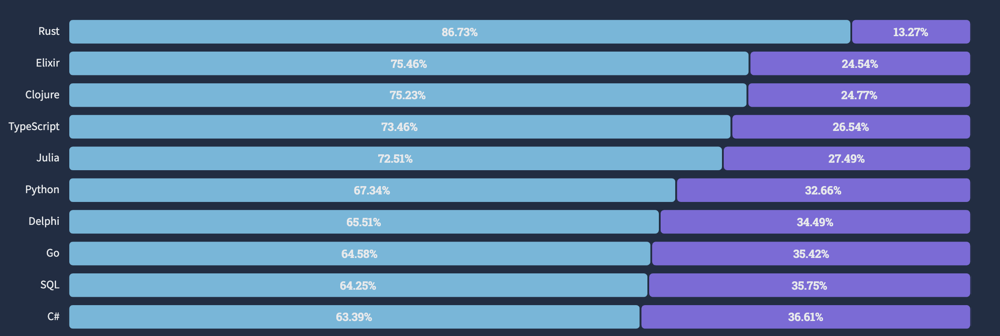
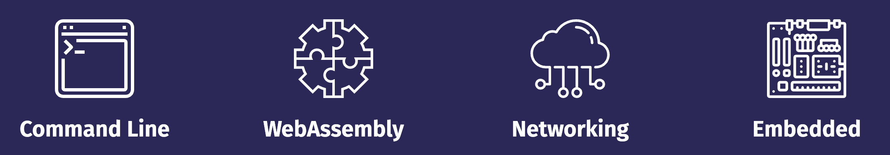
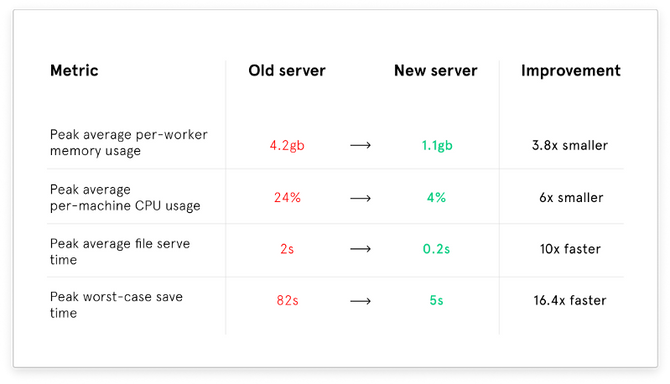
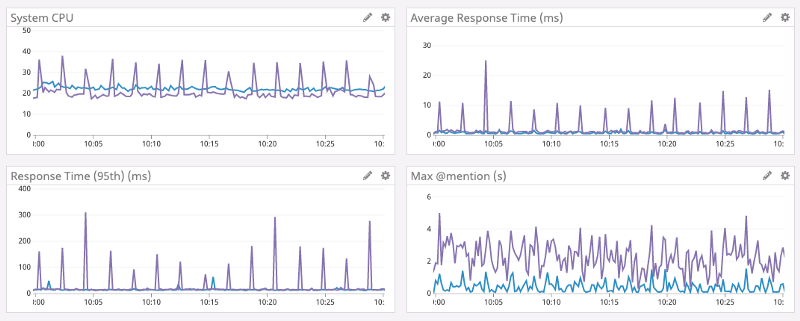

# 파이썬 프로그래머를 위한 러스트 입문

윤인도
freedomzero91@gmail.com

---

## 가장 사랑받는 언어, 러스트

```python
print("Hello, Pythonista!")
```

```rust
fn main() {
    println!("Hello, Rustacean!");
}
```

---

"Loved vs Dreaded(사랑하는 언어 대 두려운 언어)"



---


---

## 파이썬 개발자가 러스트를 배워야 하는 이유

1. 멀티스레드 프로그램 작성이 쉽다
2. 속도가 빠르다
3. 파이썬과 문법이 비슷하다


---

## 파이썬과 러스트의 차이점

### 언어상의 차이


| 파이썬                            | 러스트                           |
| --------------------------------- | -------------------------------- |
| 인터프리터 언어                   | 컴파일 언어                      |
| 강타입 언어이면서 동적 타입 언어  | 강타입 언어이면서 정적 타입 언어 |
| 메모리 관리에 가비지 콜렉터 사용  | 메모리 관리에 소유권 모델 사용   |
| 대부분의 경우 객체지향 프로그래밍 | 함수형 프로그래밍                |
| 스타일 가이드가 유연함            | 명확한 스타일 가이드 존재        |

---

### 툴 비교

> "cargo"

|                    | 파이썬                           | 러스트       |
| ------------------ | -------------------------------- | ------------ |
| 패키지 관리자      | pip                              | cargo        |
| 포매터             | black, yapf, autopep8            | cargo fmt    |
| 린터               | pylint, flake8                   | cargo clippy |
| 테스트             | pytest                           | cargo test   |
| 프로젝트 환경 관리 | virtualenv, pipenv, pyenv, conda | cargo new    |
| 문서화             | sphinx                           | cargo doc    |
| 벤치마크           | cProfile, pyspy                  | cargo bench  |

---


https://docs.rs/serde_v8/0.49.0/serde_v8/

---

### 그러면 러스트는 또 다른 C/C++ 대체 언어인가요?

| Apple                     | Google                                     | Mozilla                                                       |
| ------------------------- | ------------------------------------------ | ------------------------------------------------------------- |
| Swift                     | Go                                         | Rust                                                          |
| Mainly for iOS apps       | Dominant in network/server applications    | Dominant in system programming and CPU intensive applications |
| Memory leak still present | Possible memory leak through `goroutine` | Guarantees no memory leak                                     |


---

## Rust로 뭘 할 수 있나요?


- [솔라나(Solana)](https://github.com/solana-labs/solana)
-  [AppFlowy](https://github.com/AppFlowy-IO/appflowy)

---

### 러스트 사용 실제 사례들

코어 로직을 러스트로 재작성

#### [Dropbox](https://dropbox.tech/infrastructure/rewriting-the-heart-of-our-sync-engine)


#### [Figma](https://blog.figma.com/rust-in-production-at-figma-e10a0ec31929)



---

#### [npm](https://www.rust-lang.org/static/pdfs/Rust-npm-Whitepaper.pdf)

 레지스트리 서비스(registry service)의 병목 현상을 해결

#### [Discord](https://discord.com/blog/why-discord-is-switching-from-go-to-rust)

Go에서 Rust로 이전



---
- 페이스북에서는 백엔드 서버를 작성하는 언어 중 하나로 러스트를 채택했습니다.
- 러스트의 후원 재단인 모질라에서 개발하는 파이어폭스 브라우저의 엔진(Servo Engine)은 러스트로 작성되었습니다.
- Next.js의 컴파일 엔진은 러스트로 재작성되었습니다.
- AWS(아마존웹서비스)의 Lambda에서 컨테이너는 FireCracker라는 러스트 툴 위에서 실행됩니다.
- Sentry 역시 파이썬의 낮은 퍼포먼스를 러스트를 도입해 해결했습니다.
---
## 러스트 개발 환경 설정하기
### 러스트 툴체인 설치하기: https://rustup.rs/# 

#### macOS / Linux

맥(macOS) 또는 리눅스 사용자들은 아래 명령어를 통해 간단하게 설치가 가능합니다.

```bash
$ curl --proto '=https' --tlsv1.2 https://sh.rustup.rs -sSf | sh
```
#### Windows

윈도우 사용자의 경우 위 홈페이지에서 34비트 또는 64비트 설치 파일을 다운로드 받습니다.

---
### Visual Studio Code 설치 및 설정하기

러스트에서 제공하는 컴파일, 디버깅, 언어 서버(Language server) 등의 기능을 쉽고 편리하게 사용 가능

#### rust-analyzer 설치하기

---
#### VSCode에서 코드 실행해보기
- 메뉴에서 File - Open Folder를 클릭합니다.

- 프로젝트 폴더를 선택하거나 새로 생성한 다음 선택합니다.

- 터미널을 실행합니다. 메뉴에서 Terminal - New Terminal

- 새로운 프로젝트를 현재 폴더에 생성합니다. 터미널에 아래 명령어를 입력하고 실행합니다.
```bash
$ cargo new rust_part
```

---
- `rust_part` 폴더로 이동
- `cargo run` 명령어로 기본 코드를 컴파일하고, 바이너리를 실행합니다.

```bash
$ cargo run
Compiling temp v0.1.0 (/Users/code/temp)
    Finished dev [unoptimized + debuginfo] target(s) in 4.55s
     Running `target/debug/temp`
Hello, world!
```
---
#### rustfmt 사용하기

- 윈도우 또는 리눅스의 경우는 Alt + Shift + F
- 맥의 경우는 Option + Shift + F를 누르면 됩니다. 

 `main.rs` 에 입력하고 포맷을 실행해 보겠습니다.

```rust
fn main(    ){
    println! (
        "Please run 'rustfmt!'"
    );
}
```

실행 결과

```rust
fn main() {
    println!("Please run 'rustfmt!'");
}

```

---
## 파이썬 프로젝트 생성하기
현재 폴더에 `python` 폴더 생성
```
.
├── rust_part
│   ├── Cargo.toml
│   └── src
└── python
    └── main.py
```

---
## 러스트 폴더 구조

러스트의 프로젝트 폴더에는 다음과 같은 파일 구조가 만들어집니다.

```
.
├── Cargo.toml
└── src
    └── main.rs
```
`Cargo.toml` 파일은 프로젝트의 모든 설정값을 가지고 있는 파일
```toml
[package]
name = "rust_part"
version = "0.1.0"
edition = "2021"

# See more keys and their definitions at https://doc.rust-lang.org/cargo/reference/manifest.html

[dependencies]

```
---
- `[package]` 부분에는 현재 프로젝트의 이름과 버전, 그리고 러스트 에디션 버전이 들어 있습니다.

- `[dependencies]` 는 프로젝트의 크레이트(러스트에서는 패키지를 크레이트(crate)라고 부릅니다)의 이름과 버전이 들어가게 됩니다. 

- `src` 폴더가 실제 러스트 소스코드가 들어가는 곳입니다. 

---