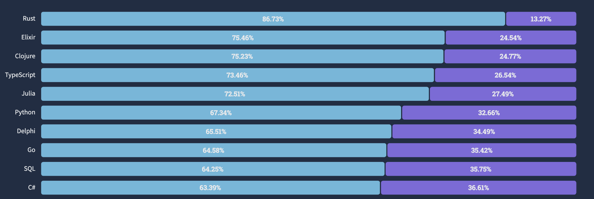

# 하드카피 출간!

더 자세한 설명, 다양한 예제가 있는 출판본도 서점에서 만나보실 수 있습니다.


[https://www.yes24.com/Product/Goods/126578252](https://www.yes24.com/Product/Goods/126578252)

<br>
---

# 온라인 강의

책 출간에 맞추어 인프런에서 새로운 강의 "세상에서 제일 쉬운 러스트 프로그래밍"도 오픈 예정입니다!

[강의 바로가기](https://inf.run/kXsni)

<br>
---

# CH1. 러스트 시작하기

## 가장 사랑받는 언어, 러스트

```python
print("Hello, Pythonista!")
```

```rust
fn main() {
    println!("Hello, Rustacean!");
}
```

파이썬은 최근 가장 인기가 높은 언어 중 하나입니다. 간결한 문법과 범용성 덕분에 서버 개발부터 딥러닝 모델 개발까지 다양한 분야에서 사용되고 있습니다. 하지만 파이썬은 개발 시의 높은 생산성을 위해 코드 실행 속도를 일정 부분 포기한 언어입니다. 특히 파이썬의 태생적 한계인 GIL(Global interpreter lock)때문에 빠른 연산이 필요한 작업이나 멀티스레딩 프로그램에서 좋은 성능을 내기 어려운 단점이 있습니다.

러스트는 높은 추상성으로 높은 생산성을 가지고 있는 동시에 C/C++의 99%에 가까운 성능을 가지고 있어서 빠른 연산속도가 필요한 분야에서 각광받고 있습니다. 2022년 스택오버플로우 개발자 설문조사의 "Loved vs Dreaded(사랑하는 언어 대 두려운 언어)"에서 러스트는 86.73%라는 높은 비율로 가장 사랑받는 언어로 선정되었습니다. 참고로, 러스트는 현재 7년 연속 가장 사랑받는 언어 1위로 선정되었습니다.



국내에서도 2022 프로그래머스 설문조사에 따르면 러스트는 5.3% 비율로 7위를 차지해 꽤 상위권에 위치해 있는 편입니다. 


