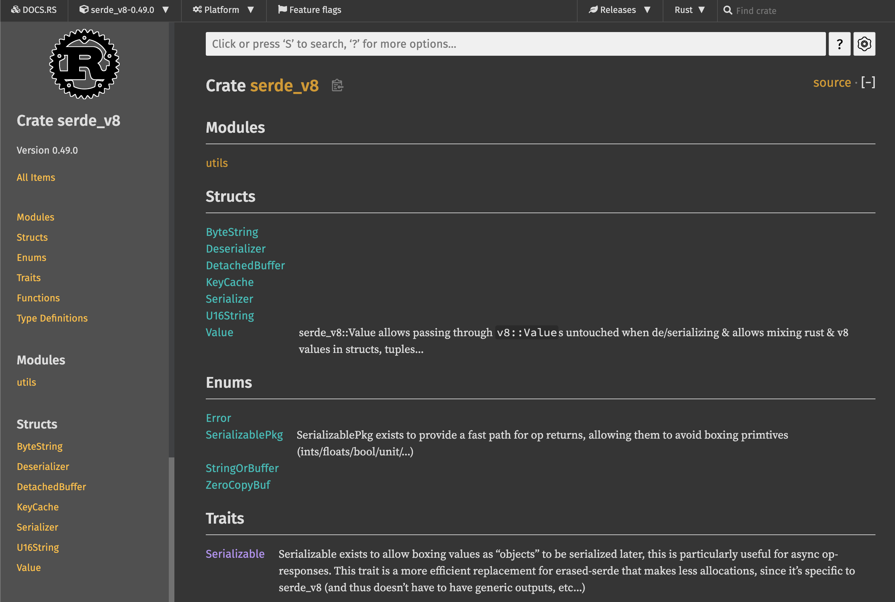

## 파이썬 개발자가 러스트를 배워야 하는 이유

왜 국내/외에서 러스트를 배우고 싶어할까요? 그리고 파이썬과 러스트의 어떤 차이점 때문에 파이썬 개발자들이 러스트를 배워야만 할까요?


### 첫째로, CPU 연산이 많이 필요한 코드를 러스트로 교체하면 빠르게 동작하는 프로그램을 만들 수 있습니다. 

파이썬은 빠르게 코드를 작성할 수 있지만, 인터프리터 언어이기 때문에 다른 컴파일 언어에 비해서 속도가 느릴 수밖에 없습니다. 따라서 많은 계산이 필요한 데이터 분석이나 수치계산 분야에서는 이미 널리 쓰이는 pandas나 numpy와 같은 라이브러리가 C++로 작성되어 있습니다. 이와 비슷하게 파이썬 코드에서 병목 현상이 발생하는 부분을 러스트로 대체한 파이썬 함수나 패키지를 만들면 큰 성능 향상을 얻을 수 있습니다.

> 러스트와 자주 비교되는 언어인 고(Go)와 다르게, 러스트에는 가비지 콜렉터가 없기 때문에 훨씬 좋은 성능을 내게 됩니다. 이러한 특징 때문에 퍼포먼스가 매우 중요한 서비스에 자주 사용됩니다.


### 둘째로, 멀티스레딩 구현이 훨씬 쉽습니다.

파이썬에서 멀티스레딩 프로그램을 구현할 때 가장 많이 겪는 문제가 스레드 레이스 조건(race condition)입니다. 러스트만의 독특한 타입 시스템과 소유권(ownership) 모델 덕분에 코드가 컴파일될 때 발생할 수 있는 메모리 혹은 스레드 문제를 미리 찾아낼 수 있기 때문에 훨씬 안정적인 프로그램을 만들 수 있습니다.

특히 파이썬은 GIL (Global Interpreter Lock) 때문에 멀티스레딩이라 하더라도 한 번에 하나의 코어밖에 사용하지 않습니다. 하지만 러스트를 사용하면 GIL 락이 걸린 순간에 여러 스레드를 사용해 더 빠르게 계산을 완료할 수 있습니다.


### 마지막으로, 개발 도구가 매우 편리합니다.

러스트는 언어 입문서와 예제 모음집이 공식적으로 제공됩니다. 그리고 매우 친절한 컴파일러가 있습니다. 때로는 컴파일 시에 발생하는 오류에 대해 적절한 해결책을 컴파일러가 제시해 주기도 합니다. 러스트의 내장 패키지 매니저인 Cargo 덕분에 빌드, 테스트, 의존성 관리 등이 매우 간편합니다. 또한 Visual Studio Code와 같은 통합개발환경(Integrated Developement Environment, IDE) 지원이 잘 되어 있어 자동완성, 타입 검사, 포매팅 등을 자연스럽게 사용할 수 있습니다.


이같은 점 때문에 7년 연속 "가장 사랑받는 프로그래밍 언어" 1위를 차지하고 있는 러스트는 더 이상 파이썬 개발자에게 선택이 아닌 필수라고 할 수 있겠습니다.


## 파이썬과 러스트의 차이점

### 언어상의 차이

먼저 기본적인 언어상의 차이를 살펴보면 다음과 같습니다. 

| 파이썬                            | 러스트                           |
| --------------------------------- | -------------------------------- |
| 인터프리터 언어                   | 컴파일 언어                      |
| 강타입 언어이면서 동적 타입 언어  | 강타입 언어이면서 정적 타입 언어 |
| 메모리 관리에 가비지 콜렉터 사용  | 메모리 관리에 소유권 모델 사용   |
| 대부분의 경우 객체지향 프로그래밍 | 함수형 프로그래밍                |
| 스타일 가이드가 유연함            | 명확한 스타일 가이드 존재        |

러스트는 컴파일 언어이기 때문에 파이썬과 다르게 코드가 실행되기 전 컴파일 단계를 거쳐야 합니다. 하지만 이때 대부분의 오류와 버그를 잡아낼 수 있기 때문에 이는 오히려 러스트의 장점이기도 합니다. 파이썬은 객체 지향 프로그래밍 언어이지만, 러스트는 함수형 프로그래밍 언어이기 때문에 파이썬과는 코드 작성 패턴이 조금 다릅니다. 이 책에서는 파이썬 코드와 러스트 코드를 비교하면서 러스트를 설명하기 때문에 두 언어의 유사성과 차이점을 통해 더욱 쉽게 러스트를 배울 수 있습니다.

> 강타입 언어란?
>
> 서로 다른 타입의 변수를 사용해 계산을 수행했을 때, 모든 경우에 대해 에러가 발생하면 강타입 언어입니다. 예를 들어 자바스크립트는 약타입 언어입니다.
>
> ```javascript
> > console.log(1 + "2");
> 
> 3
> ```


### 도구 비교

아래 표는 파이썬과 러스트의 기본 도구들을 비교한 표입니다. 파이썬의 경우, `pip` 를 제외한 도구들은 일반적으로 별도 설치가 필요합니다. 하지만 러스트는 `cargo` 라는 도구를 통해 대부분의 기능을 바로 사용할 수 있습니다. `cargo`는 크레이트(crate)라고 불리는 패키지를 관리하는 도구이면서, 동시에 소스코드를 컴파일하고 빌드하는 시스템 빌드 매니저 기능도 포함하고 있습니다. 아래 표와 같이 `cargo` 에 내장된 기능은 포맷(format), 린트(lint), 테스트, 문서화, 벤치마크 등 다양합니다. 여기에 추가로 플러그인을 설치해서 더 다양하게 `cargo` 를 사용할 수도 있습니다.

|                    | 파이썬                           | 러스트       |
| ------------------ | -------------------------------- | ------------ |
| 패키지 관리자      | pip                              | cargo        |
| 포매터             | black, yapf, autopep8            | cargo fmt    |
| 린터               | pylint, flake8                   | cargo clippy |
| 테스트             | pytest                           | cargo test   |
| 프로젝트 환경 관리 | virtualenv, pipenv, pyenv, conda | cargo new    |
| 문서화             | sphinx                           | cargo doc    |
| 벤치마크           | cProfile, pyspy                  | cargo bench  |


> 포맷과 린트의 차이점
>
> 포맷은 코드의 스타일을 기준에 맞춰 바꾸어주는 것을 의미하고, 린트는 코드가 문법 규칙에 맞는지를 검사합니다.


예를 들어 `cargo doc`을 실행하면, 아래와 같은 API 문서가 자동으로 생성됩니다. 이와 비슷하게 파이썬 문서를 생성해주는 패키지인 `sphinx` 의 경우, 별도의 추가 설치 뿐만 아니라 프로젝트별로 섬세한 설정이 필요하다는 점을 생각해보면 이는 굉장히 편리한 기능입니다.



출처: https://docs.rs/serde_v8/0.49.0/serde_v8/


### 러스트의 경쟁 언어들

위에서 잠깐 설명했듯이, 러스트로 C/C++ 바인딩 함수나 패키지를 대신할 수 있습니다. 그렇다면 왜 C/C++로 직접 프로그램을 만들거나, 다른 비슷한 언어들을 사용하지 않는 걸까요? 일단 C/C++는 생산성이 매우 떨어집니다. 숙련된 개발자가 아니라면, 메모리 안정성과 스레드 안전성을 생각하며 C/C++로 프로그램을 만드는 것 자체가 굉장히 어렵습니다. 따라서 C/C++보다는 이와 비슷한 모던 프로그래밍 언어들이 훨씬 각광받고 있습니다.

아래 표는 러스트와 경쟁 관계에 있는 비슷한 언어들의 특징을 정리해놓은 표입니다. 먼저 Apple의 Swift는 컴파일 언어이며, 높은 생산성과 성능을 자랑하지만 주로 iOS 앱 개발에만 사용됩니다. 두 번째로 Go는 높은 생산성과 비교적 빠른 성능을 가지고 있습니다. 주로 네트워크/서버 분야에 많이 사용됩니다. Go는 메모리가 완전히 안전하지 않으며, 컴파일 타임에 이러한 오류를 감지하지 못하는 경우가 많아 안정성이 떨어집니다. 또한 가비지 콜렉션을 사용하기 때문에 러스트에 비해 성능이 떨어지는 단점이 있습니다. 이러한 이유 때문에 빠른 성능과 메모리 안정성이 필요한 경우 러스트가 최고의 옵션이 됩니다.


|               | Swift                                 | Go                                                 | Rust                                                  |
| ------------- | ------------------------------------- | -------------------------------------------------- | ----------------------------------------------------- |
| 개발          | Apple                                 | Google                                             | Mozilla                                               |
| 주 사용처     | iOS, iPadOs, macOS 어플리케이션       | 네트워크 및 서버 프레임워크/어플리케이션           | CPU 사용량이 많은 어플리케이션 혹은 시스템 소프트웨어 |
| 메모리 안전성 | 메모리 누수 문제가 아직 해결되지 않음 | `goroutine` 사용 시 잠재적인 메모리 누수 발생 가능 | 메모리 안전성 보장                                    |


