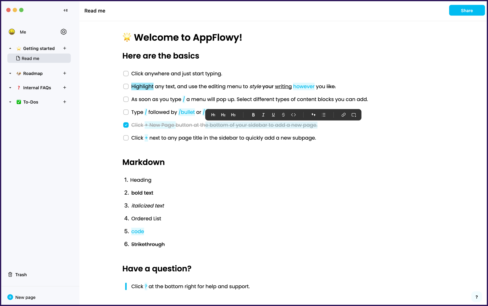

## Rust로 뭘 할 수 있나요?

러스트는 현재 다양한 분야에서 널리 사용되고 있습니다. 러스트 공식 문서에 설명에 따르면, 아래 네 분야에 가장 많이 사용됩니다.

시스템 소프트웨어의 CLI(Command Line Interface)를 만들거나, 고성능 네트워크가 필요한 분야에서 사용되고 있습니다. 러스트의 높은 성능 때문에 웹 어셈블리(WebAssembly)에서 다른 프로그래밍 언어 중에서 가장 많이 사용되고 있습니다. 하드웨어의 CPU나 메모리가 매우 제한적인 임베디드 분야에서는 전통적으로 C/C++가 가장 많이 사용되어 왔는데, 기존에 C/C++로 작성하던 코드를 러스트로 마이그레이션해 생산성과 안정성이 대폭 향상시킨 사례가 많이 보고되고 있습니다.

> 웹어셈블리란, 브라우저에서 자바스크립트가 아닌 다른 프로그래밍 언어를 실행시킬 수 있는 방법입니다. 즉 기존에 자바스크립트를 사용했을 때 발생하는 성능 저하를 러스트와 웹어셈블리를 사용하면 간단하게 해결할 수 있습니다. 

가장 유명한 러스트 프로젝트로는 암호화폐 [솔라나(Solana)](https://github.com/solana-labs/solana)가 있습니다. "세계에서 가장 빠른 블록체인"이라는 표어가 보여주듯이 러스트의 성능과 안정성을 잘 이용하고 있는 프로젝트입니다. 솔라나를 이용해 NFT, DeFi 등 다양한 프로젝트가 이어져 나가고 있어서 솔라나는 러스트 생태계에 큰 역할을 하고 있습니다.

웹 어플리케이션의 백엔드로 러스트가 사용되기도 합니다. [AppFlowy](https://github.com/AppFlowy-IO/appflowy)는 러스트로 작성된 노션(Notion) 대체제로, 온라인에서 문서를 작성하고 협업할 수 있는 오픈소스 도구입니다. 

러스트로 모바일 게임을 제작할 수도 있습니다. 가장 유명한 프로젝트로는 Bevy가 있습니다. Bevy를 사용하면 브라우저에서 게임을 실행하거나, 안드로이드, iOS 등 모바일 앱으로 게임을 만들 수도 있습니다.

이처럼 러스트는 이미 다양한 분야에서 활용되고 있습니다.

### 러스트 사용 실제 사례들

러스트는 실제 산업 전반에서 다양하게 사용되고 있습니다. 특히 빠른 계산 성능이 필요한 복잡한 프로그램에서 그 진가를 발휘하고 있습니다. 다음은 여러 유명 IT 회사들에서 러스트를 실제로 사용하고 있는 사례들입니다.

#### [Dropbox](https://dropbox.tech/infrastructure/rewriting-the-heart-of-our-sync-engine)

드랍박스는 클라우드 저장소 서비스를 운영하는 회사입니다. 드랍박스에서 가장 핵심적인 기능 중 하나는 로컬 컴퓨터에 있는 데이터를 원격 클라우드에 빠르게 동기화하는 것입니다. 기존에 C++로 작성되어 있었던 동기화 로직을 러스트로 재작성했다고 합니다.

#### [Figma](https://blog.figma.com/rust-in-production-at-figma-e10a0ec31929)

피그마는 UI 프로토타입을 제작할 수 있는 도구입니다. 웹 기반으로 동작하기 때문에, 화면에 결과를 빠르게 보여주는 것이 중요합니다. 기존의 타입스크립트 서버를 러스트로 재작성한 결과, 비약적인 성능 향상을 얻을 수 있었습니다.

#### [npm](https://www.rust-lang.org/static/pdfs/Rust-npm-Whitepaper.pdf)

npm은 Node.JS의 패키지 저장소로, 노드 패키지를 다운받으려면 반드시 거쳐야 하는 서비스입니다. 레지스트리 서비스(registry service)의 병목 현상을 해결하기 위해 다양한 프로그래밍 언어를 고려했다고 합니다. Node.JS, Go, Java 등으로 실제 구현도 해보았지만 결과적으로는 러스트가 채택되었습니다.

#### [Discord](https://discord.com/blog/why-discord-is-switching-from-go-to-rust)

디스코드는 기존에 Go로 작성된 서비스 백엔드에서 간헐적인 성능 하락이 발생하는 것을 발견했습니다. 위 그래프에서 보라색이 Go 구현체입니다. 주기적으로 CPU 피크가 발생하고 이때문에 응답시간에도 피크가 발생하는 것을 알 수 있습니다. 이런 현상의 원인은 Go의 가비지 컬렉터 때문으로, 러스트로 재작성한 후 CPU 사용량이 안정화되고, 응답 시간이 훨씬 짧아진 것을 알 수 있습니다.

이외에도 다양한 기업에서 러스트를 도입해 사용하고 있습니다.

- 페이스북에서는 백엔드 서버를 작성하는 언어 중 하나로 러스트를 채택했습니다.
- 러스트의 후원 재단인 모질라에서 개발하는 파이어폭스 브라우저의 엔진(Servo Engine)은 러스트로 작성되었습니다.
- Next.js의 컴파일 엔진은 러스트로 재작성되었습니다.
- AWS(아마존웹서비스)의 Lambda에서 컨테이너는 FireCracker라는 러스트 툴 위에서 실행됩니다.
- Sentry 역시 파이썬의 낮은 퍼포먼스를 러스트를 도입해 해결했습니다.

