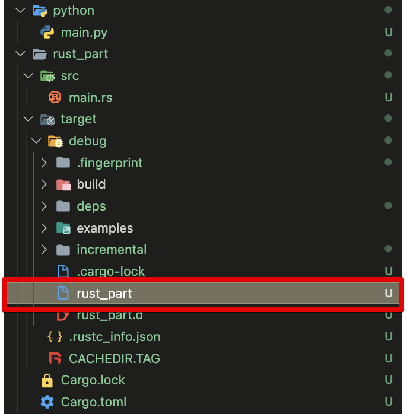

## 러스트 코드 실행하기

이번에는 러스트 코드를 컴파일하고 실행하는 방법을 알아보겠습니다.


### 코드 컴파일하기

`main.rs`파일을 열어보면, `main()` 함수에 `"Hello, world!"` 라는 문자열을 프린트하는 `println!` 만 들어있습니다.

```rust
fn main() {
    println!("Hello, world!");
}

```

코드를 컴파일하려면 `cargo build`를 사용합니다.

```bash
$ cargo build

Compiling rust_part v0.1.0 (/Users/code/temp)
 Finished dev [unoptimized + debuginfo] target(s) in 2.07s
```

러스트 폴더 밑에 `target` 이라는 폴더가 생성되고, 여기 밑에 `debug` 폴더를 열어보면 `rust_part`라는 바이너리 파일이 존재합니다.



바이너리 파일을 실행하면 다음과 같이 출력됩니다.

```bash
$ ./target/debug/rust_part
Hello, world!
```

기본적으로 빌드는 디버그 모드로 수행됩니다. 디버그 모드는 좀더 빨리 컴파일이 수행되지만, 프로그램의 실행 속도는 느려질 수 있습니다. 하지만 실제로 프로그램을 배포할 때는 컴파일 단계에서 코드를 최적화해주어야 성능을 제대로 사용할 수 있습니다. 따라서 프로그램을 배포할 때에는 다음과 같이 `--release` 옵션을 추가로 사용합니다.

```bash
$ cargo build --release

Compiling notebook v0.1.0 (/Users/code/temp)
 Finished release [optimized] target(s) in 1.34s
```

이때 바이너리 파일이 `target/release` 폴더에 생성되는 것에 주의하세요.


### 코드 실행하기

위에서 코드를 컴파일한 다음 바이너리를 실행하는 방법을 소개했습니다. 그런데 컴파일한 뒤에 바이너리를 `target` 폴더에서 찾아서 실행하는 것이 너무 번거롭습니다. 그래서 러스트에서는 `cargo run` 명령어로 컴파일과 바이너리 실행을 한 번에 할 수 있습니다.

```bash
$ cargo run
Compiling temp v0.1.0 (/Users/code/temp)
 Finished dev [unoptimized + debuginfo] target(s) in 4.55
  Running `target/debug/temp`
Hello, world!
```

명령어를 터미널에 입력하면, 먼저 코드가 컴파일되고 바이너리가 실행되는 것을 알 수 있습니다. 바이너리가 실행되어 `Hello, world!` 가 터미널에 출력됩니다.

> `cargo run` 명령어를 사용했을 때, 기본적으로는 디버그 모드로 빌드됩니다. 만일 릴리즈 모드로 실행해보고 싶다면 `--release`옵션을 추가하면 릴리즈 모드로 빌드 후 바이너리를 실행해줍니다.


### rustfmt

러스트에는 내장 코드 포맷터인 rustfmt가 설치되어 있습니다. VSCode에서는 단축키를 사용해 코드를 포맷할 수 있습니다. 윈도우 또는 리눅스의 경우는 `Alt + Shift + F`, 맥의 경우는 `Option + Shift + F`를 누르면 됩니다. 또는 터미널에서 `rustfmt src/main.rs` 명령어를 사용해도 됩니다.

아래 코드를 `main.rs` 에 입력하고, 단축키를 사용해 포맷을 실행해 보겠습니다.

```rust
fn main(    ){
    println! (
        "Please run 'rustfmt!'"
    );
}
```

실행 결과

```rust
fn main() {
    println!("Please run 'rustfmt!'");
}

```

공백 간격, 줄바꿈 등을 rustfmt가 알아서 처리해줍니다. 이처럼 공식적인 공통 포맷터가 존재하기 때문에 어떤 러스트 프로젝트라도 일관적인 소스코드 관리가 가능하다는 것이 러스트의 큰 장점입니다.

만약 현재 파일을 포함한 프로젝트의 전체 러스트 코드를 한꺼번에 포매팅하고 싶다면 아래 명령어를 사용합니다.

```bash
cargo fmt
```

