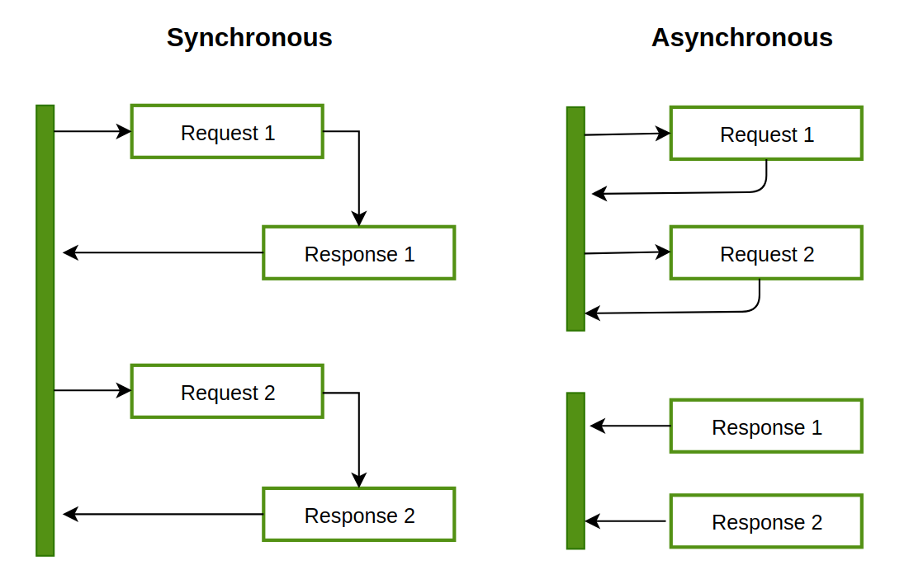

## 비동기 프로그래밍이란?

비동기 모델에서는 여러 가지 일이 동시에 일어날 수 있습니다. 프로그램에서 오래 실행되는 함수를 호출해도 실행 흐름이 차단되지 않고 프로그램이 계속 실행됩니다. 함수가 완료되면 프로그램은 결과를 알고 액세스합니다.

위 그림에서 왼쪽은 동기 함수의 실행 흐름, 오른쪽은 비동기 함수의 실행 흐름을 나타냅니다. 동기 함수의 경우, 요청1에 대한 응답이 주어질 때까지 기다렸다가 요청 2를 처리합니다. 비동기 함수는 요청1을 보낸 다음 응답이 올 때까지 기다리지 않고 바로 요청2를 처리합니다. 그 후, 응답 1과 응답2가 도착하면 결과를 바로 확인합니다.

비동기 함수를 사용하면, 프로그램 외부에서 작업이 끝나길 기다리는 동안에 다른 작업을 수행할 수 있기 때문에 효율적으로 작업을 수행할 수 있다는 장점이 있습니다.

### tokio vs rayon

Tokio와 Rayon은 모두 Rust에서 병렬 및 비동기 프로그래밍을 위한 라이브러리이지만, 초점과 사용 사례는 서로 다릅니다.

- Tokio는 주로 비동기 프로그래밍, 특히 네트워크 애플리케이션 구축을 위한 비동기 프로그래밍에 중점을 둡니다. Rust에서 효율적이고 고성능이며 확장 가능한 비동기 애플리케이션을 구축하기 위한 도구 세트를 제공합니다. Tokio는 Rust의 퓨처 및 비동기/대기 언어 기능과 함께 작동하도록 설계되었으며, 비동기 작업을 효율적으로 실행할 수 있는 런타임을 제공합니다.
- 반면 레이온은 데이터 처리 작업을 위한 병렬 처리와 동시성에 중점을 두고 있습니다. 대규모 데이터 컬렉션에 대한 계산을 병렬화하기 위한 간단하고 사용하기 쉬운 인터페이스를 제공합니다. 레이온은 Rust의 이터레이터 특성과 함께 작동하도록 설계되었으며, 데이터를 병렬로 처리하는 데 사용할 수 있는 일련의 병렬 알고리즘을 제공합니다.

요약하자면, Tokio는 비동기 네트워크 애플리케이션을 구축하는 데 이상적이며, Rayon은 대규모 데이터 컬렉션에 대한 계산을 병렬화하는 데 이상적입니다. 두 라이브러리 모두 다양한 사용 사례에 유용하며, 비동기 처리와 병렬 처리가 모두 필요한 경우에 함께 사용할 수 있습니다.
