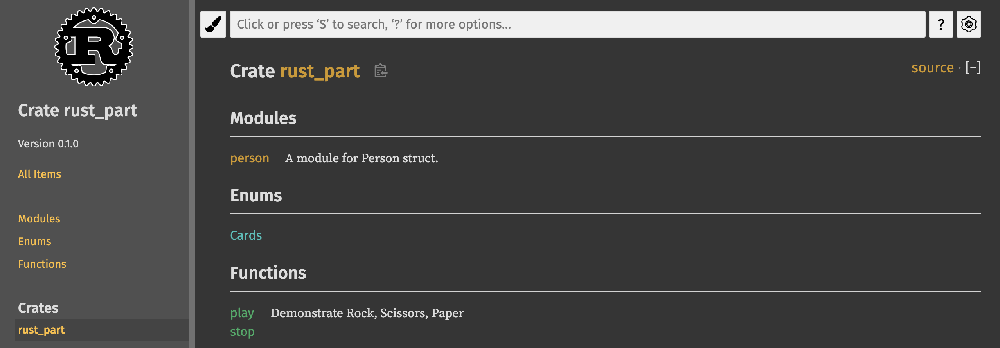
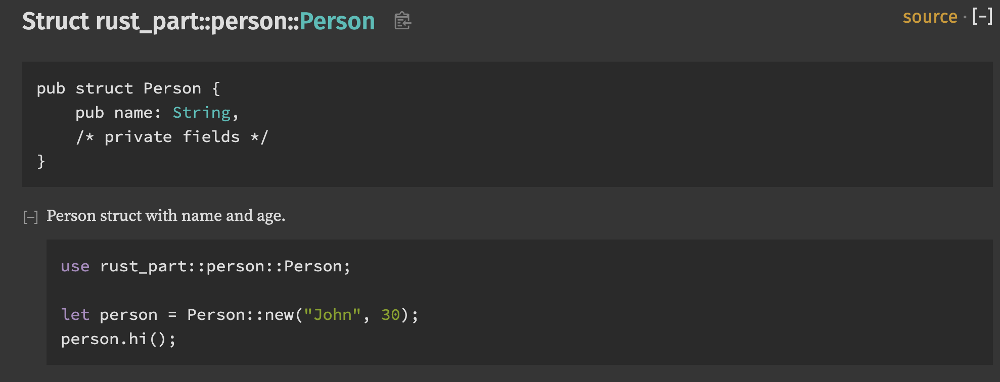

## 문서 테스트

아까 `cargo test` 를 실행했을 때, 유닛 테스트 외에도 한 가지 테스트가 더 추가로 실행됐었습니다. 바로 문서가 잘 작성되었는지를 테스트하는 문서 테스트입니다.

```
   Doc-tests rust_part

running 1 test
test src/lib.rs - play (line 10) ... ok

test result: ok. 1 passed; 0 failed; 0 ignored; 0 measured; 0 filtered out; finished in 0.55s
```

`play` 함수 위의 주석을 보면 다음과 같은 부분이 들어있습니다.

```rust,ignore
/// Demonstrate Rock, Scissors, Paper
///
/// ```
/// use rust_part::{play, Cards};
///
/// let result = play(Cards::Rock, Cards::Scissors);
/// assert_eq!(result, Some(true));
/// ```
```

`/` 을 3개 달아서 함수에 해당하는 주석이라는 것을 표시할 수 있습니다. 가장 윗 줄은 어떤 함수인지를 설명하고 있고, 그 다음 ``` 로 묶인 부분은 이 `play 함수를 사용하기 위한 예제 코드입니다. 문서 테스트가 실행되면 이 예제 코드가 컴파일되는지를 테스트합니다.

구조체와 메소드에도 별도로 주석을 추가할 수 있습니다. 아래 두 주석을 구조체와 메소드에 추가해 보겠습니다.

```rust,ignore
/// A module for Person struct.
pub mod person {
    /// Person struct with name and age.
    ///
    /// ```
    /// use rust_part::person::Person;
    ///
    /// let person = Person::new("John", 30);
    /// person.hi();
    /// ```
    pub struct Person {
        pub name: String,
        age: u8,
    }
    /// Methods defined for Person struct.
    impl Person {
        pub fn new(name: &str, age: u8) -> Person {
            Person {
                name: name.to_string(),
                age: age,
            }
        }

        pub fn hi(&self) -> String {
            format!("Hi, I'm {}, I am {} years old.", self.name, self.age())
        }

        pub fn age(&self) -> u8 {
            self.age
        }
    }
}
```

그 다음 작성된 문서를 브라우저에서 확인하기 위해 아래 명령어를 실행합니다.

```bash
cargo doc --open
```

브라우저가 실행되고 아래와 같은 메인 페이지가 나타납니다.



여기서 `person::Person` 구조체로 들어가 보겠습니다.



구조체 정의에 퍼블릭 필드만 나오는 것을 알 수 있습니다. 그리고 아까 작성한 예제 코드도 나타납니다. 이처럼 코드에 작성한 주석을 바로 문서로 만들 수 있는 것이 러스트의 큰 장점입니다.

마지막으로 문서 테스트만 실행하는 방법은 다음과 같습니다.

```bash
cargo test --doc
```


