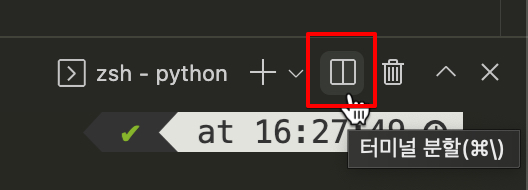
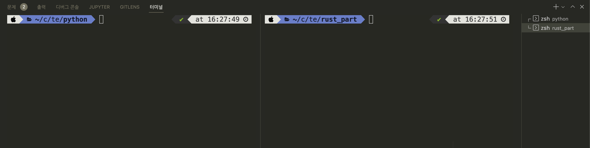

## 값 출력하기

파이썬에서는 모든 객체를 `print` 함수로 출력할 수 있습니다. 문자열 `"Hello, world!"` 를 출력하는 예제는 다음과 같습니다.

```python
print("Hello, world!")
```

반면 러스트에서는 `print` 같은 편리한 함수 대신, 매크로(macro)를 사용해 값을 출력합니다. 매크로란 사전 정의된 편리한 기능을 의미하고, 항상 이름 뒤에 `!`가 붙습니다. 매크로에 대해서는 뒤에서 다시 자세히 설명하겠습니다. 러스트 코드는 매 줄의 마지막에 세미콜론(;) 이 붙습니다. 세미콜론이 없으면 컴파일 에러가 발생하니 주의하세요. 위의 파이썬 예제와 동일하게 문자열 `"Hello, world!"` 를 출력하는 코드는 다음과 같습니다.

```rust
fn main() {
    println!("Hello, world!");
}

```


## 변수 선언

변수란 메모리에 값을 저장하기 위해 사용되는 개념입니다. 변수의 이름을 통해 메모리에 저장된 값을 참조해서 사용할 수 있습니다. 파이썬은 변수 선언 시 타입을 명시하지 않아도 되기 때문에 실수값과 정수값 모두 변수에 바로 할당이 가능합니다. 파이썬에서 변수 `x` 와 `y` 를 선언하고 실수 1.0과 정수 10을 할당한 다음, f-string을 사용해 두 변수의 값을 출력합니다. `main.py` 에 다음 내용을 입력합니다.

```python
x = 1.0
y = 10

print(f"x = {x}, y = {y}")
```

파이썬 코드 실행 결과는 다음과 같습니다. 폴더를 하위 폴더인 "python"으로 이동한 다음 코드를 실행해야 합니다.

```bash
/code/temp/python $ python main.py
x = 1.0, y = 10
```

러스트에서는 `let` 키워드를 사용해 변수를 선언합니다. 그리고 타입을 `:` 뒤에 명시합니다. 

```rust,ignore
 변수명  타입   값
let x: i32 = 10;
```

대부분의 경우에서는 컴파일러가 타입을 추측해주지만, 몇몇 경우에는 직접 타입을 명시해줘야 하기도 합니다. 아래 예제에서는 실수 1.0을 `f64` 타입으로 선언했지만, 실제로는 변수 `y`와 같이 명시적으로 타입을 적어주지 않아도 컴파일이 됩니다. 다음으로 `prinln!` 매크로에서는 문자열의 `{}` 자리에 변수가 순서대로 들어가 전체 문자열이 완성됩니다.

```rust
fn main() {
    let x: f64 = 1.0;
    let y = 10;

    println!("x = {:.1}, y = {}", x, y);
}
```
[러스트에서 파이썬 코드의 실행 결과와 같게끔 하려면 소숫점 표현이 필요해서 :.1을 삽입하였습니다.]: #

하위 폴더인 "rust_part" 폴더로 이동한 다음, `cargo run` 을 실행해 결과를 확인해보겠습니다.

```bash
/code/temp/rust_part $ cargo run
x = 1.0, y = 10
```

파이썬과 러스트 모두 같은 결과가 나오는 것을 알 수 있습니다.

앞으로 파이썬 코드와 러스트 코드를 동시에 실행해야 하기 때문에, VSCode 터미널의 분할(split) 기능을 사용하면 편리합니다. 터미널을 연 다음, 우측 상단의 "터미널 분할"을 클릭합니다.



그리고 분할된 화면에서 하나는 파이썬 프로젝트를, 나머지는 러스트 프로젝트로 이동해 두면 편리하게 코드를 실행할 수 있습니다.




## 작명 규칙

파이썬과 러스트의 작명 규칙은 정말 비슷합니다. 대표적인 몇 가지 경우를 살펴보면 다음과 같습니다.

|               | 파이썬                     | 러스트                                 |
| ------------- | -------------------------- | -------------------------------------- |
| 변수          | `snake_case = 3`           | `let snake_case = 3;`                  |
| 함수          | `def my_function`          | `fn my_function`                       |
| 클래스/구조체 | `class MyClass`            | `struct MyStruct`                      |
| 상수          | `SCREAMING_SNAKE_CASE = 1` | `const SCREAMING_SNAKE_CASE: i32 = 1;` |

- 변수와 함수의 경우, 둘 다 스네이크 케이스(Snake case)를 사용합니다. 스네이크 케이스란, 모든 단어를 숫자 또는 알파벳 소문자로 작성하고, 단어 구분은 언더바(_)로 합니다. 단 변수명은 반드시 알파벳 소문자로만 시작해야 합니다.
- 파이썬의 클래스와 러스트 구조체는 파스칼 케이스(Pascal case)를 사용합니다. 파스칼 케이스는 대문자로 단어를 시작하고, 단어 구분을 대문자로 하는 작명법입니다.
- 상수의 경우는 둘 다 스크리밍 스네이크 케이스(Screaming snake case)를 사용합니다. 모든 알파벳이 대문자이고, 단어 구분을 언더바로 합니다. 단, 러스트의 상수는 반드시 타입을 명시해야 합니다.
