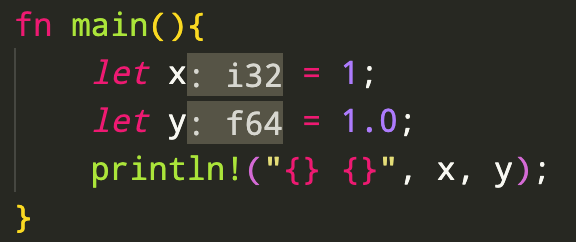

## 타입

C언어 계열과 마찬가지로, Rust는 타입이 존재합니다. 러스트의 원시 타입(primitive type) 목록은 다음과 같습니다.

| 이름 | 타입 |
| ---- | ---- |
| 8비트 정수 | `i8` |
| 16비트 정수 | `i16` |
| 32비트 정수  | `i32` |
| 64비트 정수  | `i64` |
| 128비트 정수 | `i128` |
| 아키텍처 | `isize` |
| 부호 없는 8비트 정수 | `u8` |
| 부호 없는 16비트 정수 |`u16` |
| 부호 없는 32비트 정수 | `u32` |
| 부호 없는 64비트 정수 | `u64` |
| 부호 없는 128비트 정수 |`u128` |
| 부호 없는 아키텍처 |`usize`  |
| 불리언 | `bool` |
| 문자열 | `String` |
| 문자열 슬라이스 | `str` |
| 32비트 부동소수점 실수 | `f32` |
| 64비트 부동소수점 실수 | `f64` |

>  `isize` 와 `usize` 는 컴퓨터 아키텍처가 32비트인지 64비트인지에 따라서 값이 달라지는 기본 포인터 크기입니다.


### 타입 추론

러스트 코드를 작성할 때 대부분의 경우에는 개발자가 변수에 타입을 지정하지 않아도 앞에서 설치한 `rust-analyzer`가 알아서 타입을 추론(inference)해서 화면에 보여줍니다. 비슷한 원리로 코드가 컴파일될 때에는 컴파일러가 타입을 추론해서 변수를 선언하게 됩니다. 이때, 추측되는 타입의 기본값은 정수형은 `i32` , 실수형은 `f64` 입니다.

다음 코드를 VSCode에 붙여넣으면 아래 그림과 같이 타입이 추론되는 것을 볼 수 있습니다.

```rust
fn main(){
    let x = 1;
    let y = 1.0;
    println!("{} {}", x, y);
}
```



마찬가지로 이 상태로도 컴파일이 잘 실행되고, 컴파일러가 각 변수를 `i32` 와 `f64` 로 추측해서 컴파일합니다.

실행결과

```
1 1
```


### 타입 캐스팅

변수의 타입을 다른 타입으로 바꾸는 타입 변환(Casting)도 가능합니다. 파이썬에서는 타입 이름을 바로 사용해 타입 변환을 수행합니다.

```python
x = 1.2
y = int(x)
print(f"{x} -> {y}");
```

실행결과

```
1.2 -> 1
```

러스트에서는 아래와 같이 `as` 키워드를 사용하면 됩니다. 예제에서는 64비트 실수 `f64` 로 선언된 변수 `x` 의 값을 32비트 정수 `i32` 로 변환해 `y` 변수에 할당하고 있습니다. 실수에서 정수로 변환했기 때문에 값이 1.2에서 1로 변경됩니다.

```rust
fn main() {
    let x: f64 = 1.2;
    let y = x as i32;
    println!("{} -> {}", x, y);
}

```

실행결과

```
1.2 -> 1
```


