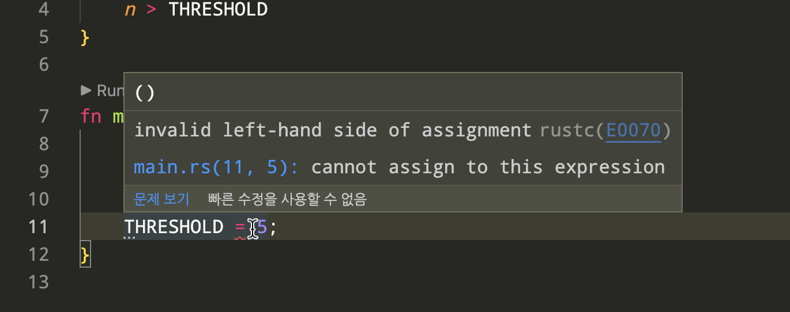

## 상수

상수(constant)란, 한 번 선언되면 값이 바뀌지 않는 변수를 의미합니다. 먼저 파이썬에서 상수를 다음과 같이 선언해 보겠습니다.

```python
THRESHOLD = 10


def is_big(n: int) -> bool:
    return n > THRESHOLD


if __name__ == '__main__':
    print(THRESHOLD)
    print(is_big(THRESHOLD))

    THRESHOLD = 5

```

실행 결과

```
10
False

```

일반적으로 상수는 모듈의 가장 위에 선언합니다. 이렇게 선언하게 되면, 모듈의 모든 범위에서 상수에 접근하는 것이 가능합니다. `is_big` 이라는 함수 안에서도 상수 `THRESHOLD` 를 사용할 수 있고, 함수를 실행하는 `if` 문 안에서도 `THRESHOLD` 를 사용합니다. 하지만 파이썬의 모든 변수는 기본적으로 가변이기 때문에 위에서 선언한 상수를 변경할 수 있다는 문제가 있습니다.

러스트에서 동일한 내용을 구현해 보겠습니다. 여기서 `is_big` 이라는 새로운 함수를 선언했는데, 함수의 선언에 대한 자세한 설명은 다음 챕터에서 다룰 예정입니다.

```rust
const THRESHOLD: i32 = 10;

fn is_big(n: i32) -> bool {
    n > THRESHOLD
}

fn main() {
    println!("{}", THRESHOLD);
    println!("{}", is_big(5));
}

```

실행결과

```
10
false
```


러스트에서는 상수를 `const` 키워드로 선언하게 됩니다. 이렇게 선언된 상수는 불변이기 때문에 값을 변경할 수 없습니다. 파이썬에서 상수를 모듈 전체에서 접근할 수 있었던 것처럼, 마찬가지로 러스트에서도 선언된 상수 `THRESHOLD` 를 함수 `is_big` 과 `main` 내부에서 참조하는 것이 가능합니다. 하지만 값이 불변이기 때문에 `THRESHOLD = 5;`와 같이 새로운 값을 할당하게 되면 오류가 발생합니다. 

```rust,ignore
const THRESHOLD: i32 = 10;

fn is_big(n: i32) -> bool {
    n > THRESHOLD
}

fn main() {
    println!("{}", THRESHOLD);
    println!("{}", is_big(5));

    THRESHOLD = 5;
}

```

실행결과

```
  --> src/main.rs:11:15
   |
11 |     THRESHOLD = 5;
   |     --------- ^
   |     |
   |     cannot assign to this expression
```

컴파일러가 친절하게 상수 `THRESHOLD` 에는 새로운 값을 할당할 수 없다고 알려주게 됩니다. 실행하기 전 편집기 안에서도 빨간 줄로 해당 코드에 문제가 있음을 알려주기 때문에 문제를 빠르게 찾고 해결할 수 있습니다.

